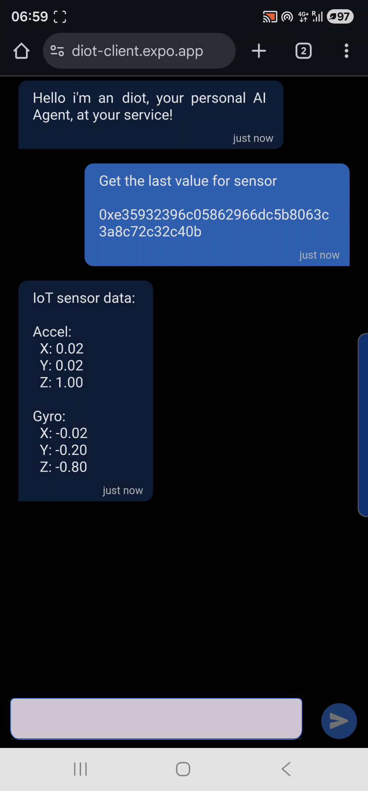
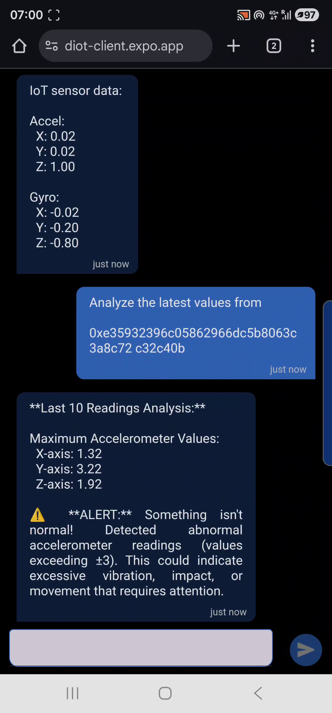
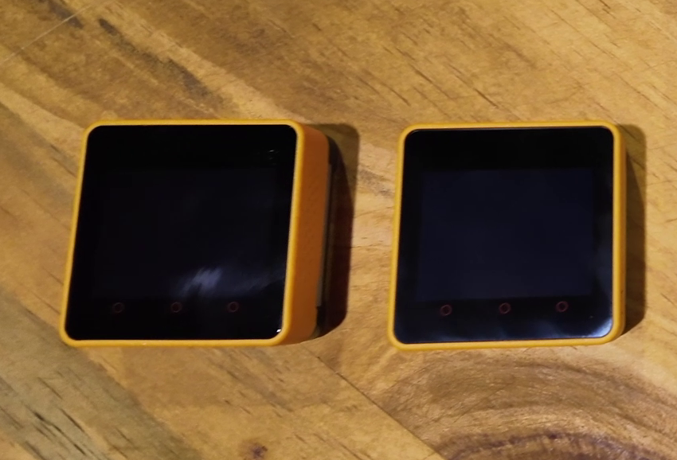
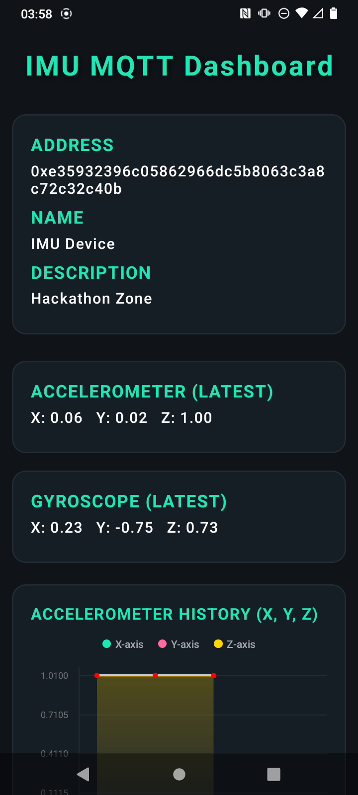
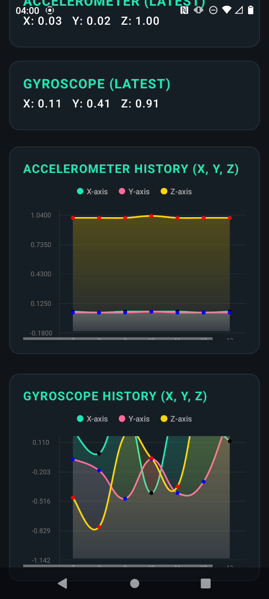
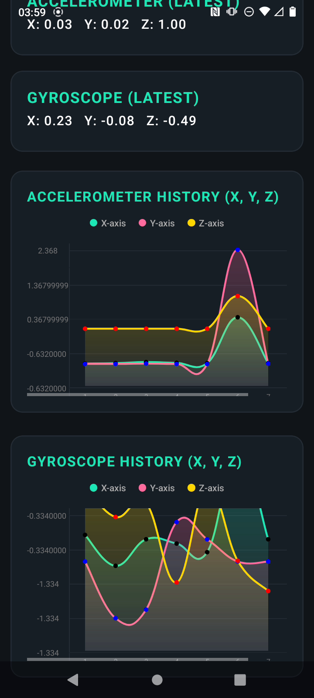
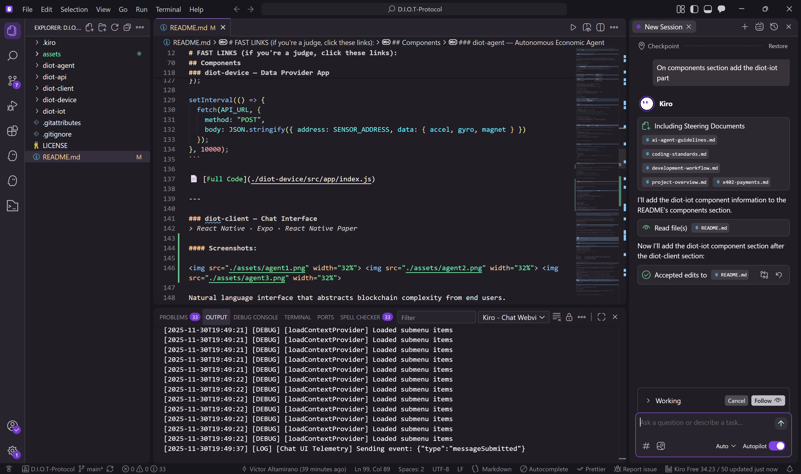

# D.I.O.T Protocol


## Decentralized Internet of Things Protocol

> A machine-to-machine payments and data-exchange network powered by autonomous agents, x402 messaging, and on-chain verification. Where machines pay machines for truth.

[](https://opensource.org/licenses/MIT)
[](https://kiro.ai)

# FAST LINKS (if you're a judge, click these links):

* [Live Demo](https://diot-client.expo.app/)
* [Kiro Config](./.kiro)
* [Development Guide](#built-with-kiro-ai)

## Overview

**D.I.O.T Protocol** is a trustless, self-sustaining data marketplace where IoT devices autonomously buy, sell, and settle for real-world sensor data. Each device runs a lightweight agent that uses the CDP Facilitator to enable machine-to-machine payments via x402 protocol on Base network.


| Capability | Description |
|------------|-------------|
| 🤖 Autonomous Agent Economy | Devices operate as independent economic actors |
| 💰 x402 Micropayments | $0.001-$0.005 per query via blockchain HTTP payments |
| 🔗 On-Chain Verification | Sensor readings signed, validated, and anchored on-chain |
| 📈 Financial Incentives | Data providers earn revenue per query |
| 💬 Natural Language Interface | AI agents translate conversational queries into transactions |

### How It Works

```
┌─────────────────┐    POST /api/sensors    ┌─────────────────┐
│  Sensor Device  │ ──────────────────────► │    diot-api     │
│  (Data Provider)│                         │   (Marketplace) │
└─────────────────┘                         └────────┬────────┘
                                                     │
┌─────────────────┐    x402 Payment + GET   ┌────────▼────────┐
│   diot-client   │ ◄────────────────────── │   diot-agent    │
│  (Chat Interface)│                        │  (AI + Wallet)  │
└─────────────────┘                         └─────────────────┘
```

**Payment Flow:**
1. Sensor device collects data → publishes to marketplace
2. User asks question in natural language
3. AI agent decides which data to purchase
4. Agent pays via x402 → receives data → analyzes → responds

### Marketplace Economics

| Role | Earnings | Action |
|------|----------|--------|
| Data Provider | $0.001-$0.005/query | Publish sensor readings |
| AI Agent | Autonomous | Decides when to buy data |
| Blockchain | — | Trustless payment verification |

### Tech Stack

| Layer | Technology |
|-------|------------|
| Mobile Apps | React Native + Expo (iOS/Android/Web) |
| AI Agent | LangChain + Ollama (llama3.1:8b) |
| Payments | x402 protocol on Base network |
| Storage | LowDB (future: IPFS/Arweave) |
| Hardware | ESP32/M5Stack support |

## Components

### diot-api — Data Marketplace Backend
> Node.js · Express · x402-express · LowDB · CDP Facilitator

The marketplace coordinator that verifies payments and facilitates data exchange.

```javascript
// x402 payment middleware - pay per endpoint
const x402RouteConfigs = {
  "GET /api/sensors/latest": { price: "$0.001", network: "base" },
  "GET /api/sensors/latestTop": { price: "$0.005", network: "base" }
};
app.use(paymentMiddleware(RECEIVING_ADDRESS, x402RouteConfigs, facilitator));
```

| Endpoint | Price | Description |
|----------|-------|-------------|
| `GET /api/sensors` | Free | List all sensors |
| `GET /api/sensors/latest?address=0x...` | $0.001 | Latest reading |
| `GET /api/sensors/latestTop?address=0x...` | $0.005 | Last 10 readings |

📄 [Full Code](./diot-api/index.js)

---

### diot-agent — Autonomous Economic Agent
> LangChain · LangGraph · Ollama · x402-fetch · viem · CDP Facilitator

An AI that operates its own wallet, autonomously deciding when to purchase data based on user queries.

**Workflow:** User asks → Agent selects tool → Pays via x402 → Analyzes data → Responds

```javascript
// Autonomous payment execution
const fetchWithPay = wrapFetchWithPayment(fetch, walletClient);
const response = await fetchWithPay(`${API_URL}/api/sensors/latest?address=${address}`);

// Built-in anomaly detection
if (Math.abs(x) > 3 || Math.abs(y) > 3 || Math.abs(z) > 3) {
  alert = "⚠️ ALERT: Abnormal vibration detected!";
}
```

📄 [Full Code](./diot-agent/index.js)

---

### diot-device — Data Provider App
> React Native · Expo · expo-sensors

Transforms smartphones into autonomous data providers that earn revenue.

```javascript
// Collect and publish sensor data every 10 seconds
Accelerometer.addListener((data) => {
  const filtered = applyLowPassFilter(data, gravity, 0.8);
});

setInterval(() => {
  fetch(API_URL, {
    method: "POST",
    body: JSON.stringify({ address: SENSOR_ADDRESS, data: { accel, gyro, magnet } })
  });
}, 10000);
```

📄 [Full Code](./diot-device/src/app/index.js)

---

### diot-client — Chat Interface
> React Native · Expo · React Native Paper

#### Screenshots:

   

Natural language interface that abstracts blockchain complexity from end users.

```javascript
// Simple chat API
const response = await fetch("/api/chatWithAgent", {
  method: "POST",
  body: JSON.stringify({ message, context: { address } })
});
```

📄 [Full Code](./diot-client/src/app/index.js)

---

### diot-iot — Hardware Sensor Device
> Arduino/ESP32 · C++ · WiFi · HTTP Client

#### Physical Devices:



#### Screenshots (Monitor):

   

Physical IoT hardware that collects real-world sensor data and publishes it to the marketplace.

```cpp
// Connect to WiFi and publish sensor readings
WiFiClient client;
HTTPClient http;

void loop() {
  // Read sensors (temperature, humidity, pressure, TVOC, eCO2, accelerometer)
  float temperature = readTemperature();
  float humidity = readHumidity();
  
  // Publish to marketplace
  http.begin(client, API_ENDPOINT);
  http.addHeader("Content-Type", "application/json");
  String payload = buildSensorPayload(temperature, humidity, ...);
  http.POST(payload);
  
  delay(10000); // Publish every 10 seconds
}
```

**Supported Hardware:**
- ESP32 / ESP8266
- M5Stack devices
- Arduino with WiFi capability

**Sensor Types:**
- Environmental (temperature, humidity, pressure)
- Air quality (TVOC, eCO2)
- Motion (accelerometer, gyroscope, magnetometer)

📄 [Full Code](./diot-iot/code.ino)

---

# Built with Kiro AI — Professional AI-Assisted Development

> **2 weeks from concept to production** — 1,450+ lines of code, 85% AI-generated

**This isn't "vibe coding" — it's professional software engineering accelerated by AI.**

Kiro becomes a serious development tool when you treat it like one. With proper configuration (specs, steering, hooks, MCP), it handles production-grade complexity while you maintain architectural control. The result: professional developers with domain expertise achieve 10x implementation velocity.

### Development Approach

We combined **spec-driven development** for complex features (50+ requirements across 5 specs) with **conversational coding** for rapid iteration. Kiro read our specs and implemented features systematically while maintaining consistent code style through steering documents.



### Kiro Features Used

**🪝 Agent Hooks** — 6 automated quality checks (security scan, lint, error handling, performance, complexity, commit messages). *Impact: 20 min manual review → 30 seconds*

**📋 Steering Documents** — 5 always-included context docs eliminated repetitive explanations. *Result: 90% reduction in "how do I..." questions*

**🔌 MCP Integration** — Coinbase Developer Platform server for live x402 development on this project.

```json
// .kiro/settings/mcp.json
{ "mcpServers": { "coinbase-mcp": { "url": "https://docs.cdp.coinbase.com/mcp" } } }
```

### Development Metrics

> *Estimated values — this project was built from zero to production entirely with AI assistance, making precise tracking impractical.*

| Component | Lines | AI Generated | Time Saved |
|-----------|-------|--------------|------------|
| diot-agent | ~320 | ~95% | ~6h |
| diot-api | ~167 | ~90% | ~3h |
| diot-client | ~561 | ~80% | ~8h |
| diot-device | ~261 | ~80% | ~5h |
| diot-iot | ~152 | ~70% | ~3h |
| **Total** | **~1,461** | **~85%** | **~25h** |

### Kiro Configuration

```
.kiro/
├── specs/          # 5 requirement documents (AI Agent, Client, IoT, Device, API)
├── steering/       # 5 context docs (project, workflow, agent, standards, x402)
├── hooks/          # 6 quality automation hooks
└── settings/       # MCP server configuration
```

📄 [FULL CONFIG FOLDER](./kiro)

### Key Learnings

**What makes the difference between toy projects and production systems?** Configuration and discipline.

This project demonstrates that AI-assisted development can handle real-world complexity when you invest in proper infrastructure. The difference isn't the AI — it's how you set it up.

| Insight | Impact |
|---------|--------|
| **Infrastructure first, code second** | Steering + specs + hooks created a foundation for consistent, quality output |
| **Write steering docs first** | 1 hour investment saved 10+ hours of repetitive explanations |
| **Specs for complexity, chat for iteration** | Structured approach for features, conversational for refinement |
| **Trust AI output with good context** | 85% production-ready code when Kiro has full project understanding |
| **Build hooks early** | Automated quality checks compound — minutes saved per use = hours saved overall |
| **Context is everything** | Open files + steering + MCP = dramatically better, architecture-aware suggestions |
| **Real developers benefit most** | Domain knowledge + AI execution = 10x velocity on implementation |

---

## License

MIT License — see [LICENSE](LICENSE) for details.

## Acknowledgments

[Kiro AI](https://kiro.ai) · [Coinbase x402](https://github.com/coinbase/x402) · [Ollama](https://ollama.ai) · [LangChain](https://langchain.com)

---

<p align="center"><b>Built for the Kiro Hackathon 2025</b></p>
